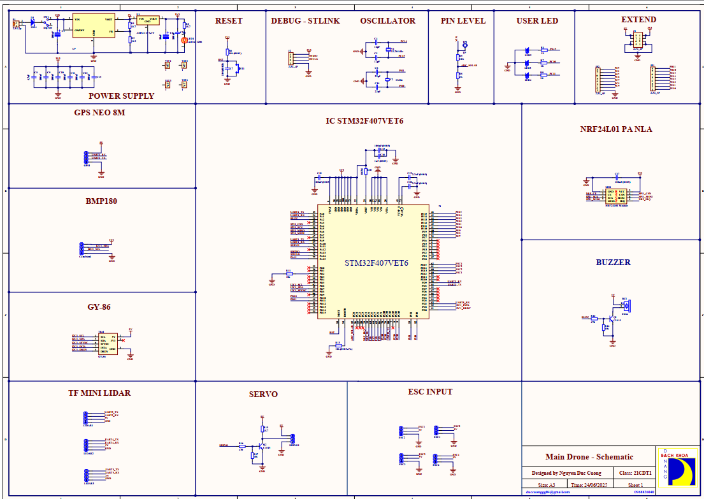
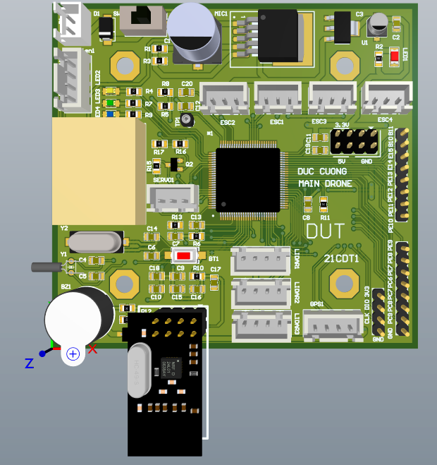
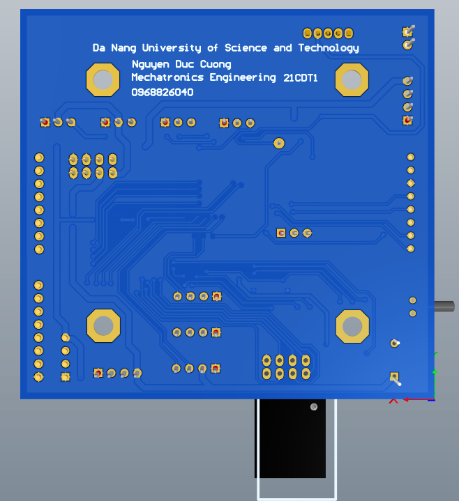
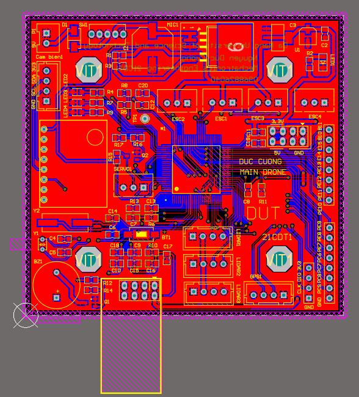
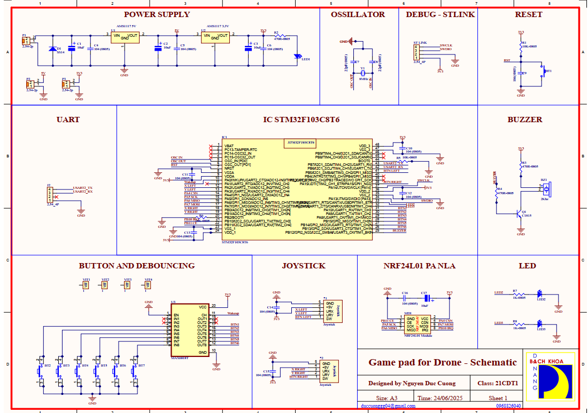
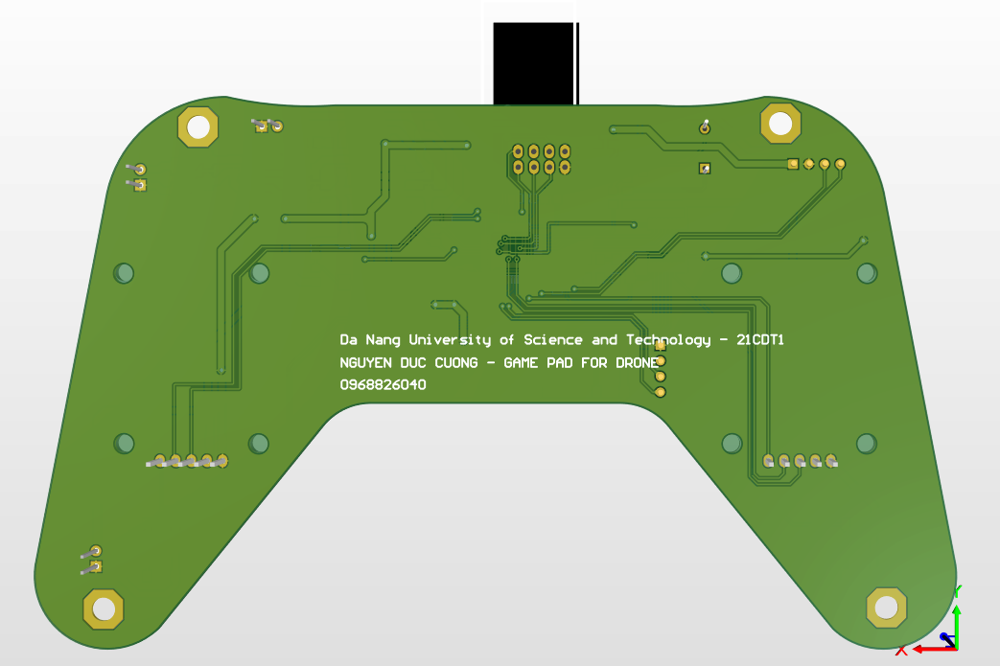
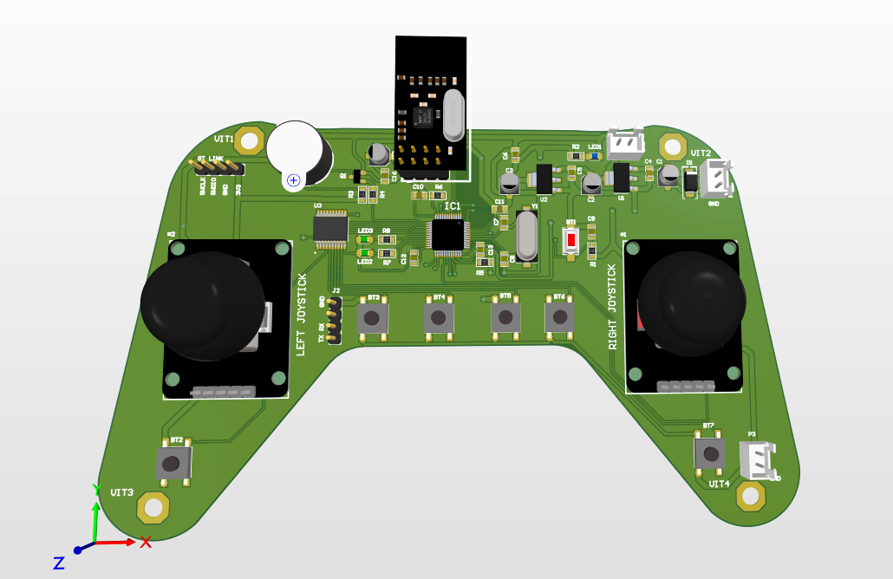
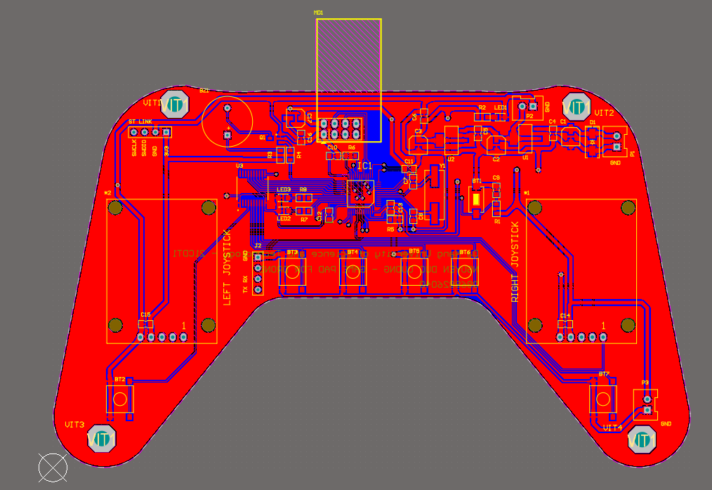

# Main Drone Board – Thiết kế mạch điều khiển trung tâm

Tài liệu này ghi lại các bước thiết kế mạch in cho bo mạch chính của drone, dùng vi điều khiển STM32F407VET6, tích hợp các khối điều khiển động cơ, cảm biến, truyền thông và giao tiếp.

  

## 🔧 Các bước thiết kế

### Bước 1: Phân tích chức năng hệ thống
- Mạch trung tâm điều khiển:
  - 4 ESC (điều khiển động cơ)
  - 3 cảm biến TF-Mini Lidar
  - 1 GPS Neo-8M
  - Module NRF24L01 (giao tiếp không dây)
  - GY-86 (IMU + BMP180)
  - Buzzer cảnh báo
  - LED trạng thái
  - Giao tiếp UART, I2C, SPI
- MCU trung tâm: **STM32F407VET6**, 100 chân, hiệu suất cao.

### Bước 2: Tách khối chức năng
- Khối nguồn (3.3V và 5V)
- Khối cảm biến (GY-86, TF-Mini, GPS)
- Khối truyền thông (NRF24L01)
- Khối điều khiển ESC
- Khối debug và nạp (ST-Link)
- Khối giao tiếp UART/I2C/SPI
- Buzzer và LED

### Bước 3: Sơ đồ khối logic
- STM32 kết nối:
  - SPI1 ↔ NRF24L01
  - UART1 ↔ GPS
  - UART3/4/5 ↔ Lidar
  - I2C1 ↔ GY-86
  - GPIO điều khiển ESC, servo, LED
- Xung clock chính:
  - 8MHz (thạch anh Y2)
  - 32.768kHz (Y1) cho RTC

### Bước 4: Thiết kế nguồn
- **Nguồn đầu vào VIN** cấp qua diode SS34.
- Hạ áp bằng AMS1117-3.3V → cấp 3V3 cho MCU, cảm biến, NRF.
- Lọc nguồn bằng tụ 10uF, 100nF.
- Nguồn 5V cấp cho ESC, GPS, Lidar, GY-86.

### Bước 5: Vẽ schematic theo datasheet
- STM32F407: cấp nguồn, clock, reset, boot, SWDIO/SWCLK.
- NRF24L01: dùng SPI1 + GPIO CE, IRQ.
- GY-86: giao tiếp I2C (SCL, SDA), SFYNC, INTA, DRDY.
- GPS: UART1 TX/RX.
- Lidar: UART3/4/5.
- ESC: kết nối qua GPIO.
- Buzzer: dùng transistor NPN + điện trở R14.
- Servo: điều khiển qua GPIO + transistor Q2.

### Bước 6: Vẽ sơ đồ nguyên lý tổng thể
- Kết nối đầy đủ tất cả khối theo chân MCU.
- Ghi chú rõ ràng các nhãn tín hiệu và nguồn.

### Bước 7: Thiết kế PCB
- Tối ưu bố trí IC trung tâm, giao tiếp ngoại vi ngắn gọn.
- Đảm bảo mass và power đi vững chắc.
- Chú ý đường tín hiệu SPI/I2C/UART không giao chéo.

### Bước 8: Sản xuất và kiểm thử
- Xuất file Gerber.
- Hàn mạch và kiểm tra lần lượt:
  - Nguồn ổn áp đúng
  - Giao tiếp UART, SPI, I2C
  - NRF hoạt động
  - GPS nhận tín hiệu
  - Lidar đo chính xác
  - ESC điều khiển đúng kênh

## 🛠️ Tác giả & Thông tin

- Tên dự án: **Main Drone Control Board**
- Thiết kế bởi: **Nguyễn Đức Cường - Lớp 21CDT1**
- Email: duccuonggg04@gmail.com
- Ngày thiết kế: 24/06/2025

# Thiết kế mạch in - Tay cầm drone

Tài liệu này trình bày quy trình thiết kế một mạch in (PCB) cho tay cầm điều khiển drone, dựa trên yêu cầu kỹ thuật và tài liệu gốc (`Machtaycam.pdf`).

  

## 🔧 Các bước thiết kế

### Bước 1: Khảo sát ý tưởng, yêu cầu cụ thể
- Xác định mục tiêu dự án.
- Khảo sát tính năng cần có: joystick, nút bấm, NRF24L01, LED, nguồn, v.v.
- Tính toán tổng thể để chọn nền tảng phù hợp (STM32F103C8T6).

### Bước 2: Bóc tách tính năng
- Tách riêng các tính năng: giao tiếp SPI, UART, ADC, nút nhấn, LED, nguồn.
- Xem xét độc lập từng khối và phạm vi điều khiển.

### Bước 3: Định nghĩa kỹ thuật
- Chọn linh kiện: vi điều khiển, nguồn, tụ điện, điện trở, LED, module RF.
- Xác định chuẩn giao tiếp: SPI (NRF24L01), ADC (joystick), GPIO (nút, LED).
- Giao thức truyền thông: sử dụng UART và SPI.

### Bước 4: Tạo sơ đồ khối
- Vẽ sơ đồ tổng thể phân chia khối chức năng:
  - MCU (STM32)
  - Khối cấp nguồn
  - Khối truyền thông không dây
  - Khối joystick
  - Khối nút nhấn
  - Khối LED hiển thị
  - ST-Link debug

### Bước 5: Chọn IC nguồn và tạo sơ đồ nguồn
- Dùng AMS1117-5V và AMS1117-3.3V để hạ áp từ VCC.
- Bảo vệ nguồn bằng diode SS14.
- Lọc nguồn bằng tụ 10uF và 100nF.

### Bước 6: Vẽ schematic các khối dựa theo datasheet
- STM32F103: sơ đồ chân, thạch anh, nguồn, reset, debug.
- NRF24L01: kết nối SPI.
- Joystick: đầu ra ADC.
- MAX6818: xử lý chống dội nút.
- LED, nút bấm: điện trở kéo lên/kéo xuống.

### Bước 7: Vẽ schematic tổng thể dự án
- Kết nối toàn bộ các khối lại.
- Đảm bảo cấp nguồn phù hợp và định tuyến rõ ràng.

### Bước 8: Vẽ PCB
- Sắp xếp linh kiện hợp lý.
- Định tuyến theo nguyên tắc: ngắn gọn, tránh giao chéo, phân biệt rõ mass/nguồn.

### Bước 9: Đặt mạch in, test
- Xuất Gerber và gửi đi sản xuất.
- Hàn mạch và kiểm tra chức năng từng phần: nguồn, nạp code, joystick, giao tiếp NRF24, v.v.

## 🛠️ Tác giả & Thông tin

- Tên dự án: **Gamepad for Drone**
- Thiết kế bởi: **Nguyễn Đức Cường - Lớp 21CDT1**
- Email: duccuonggg04@gmail.com
- Ngày thiết kế: 24/06/2025

